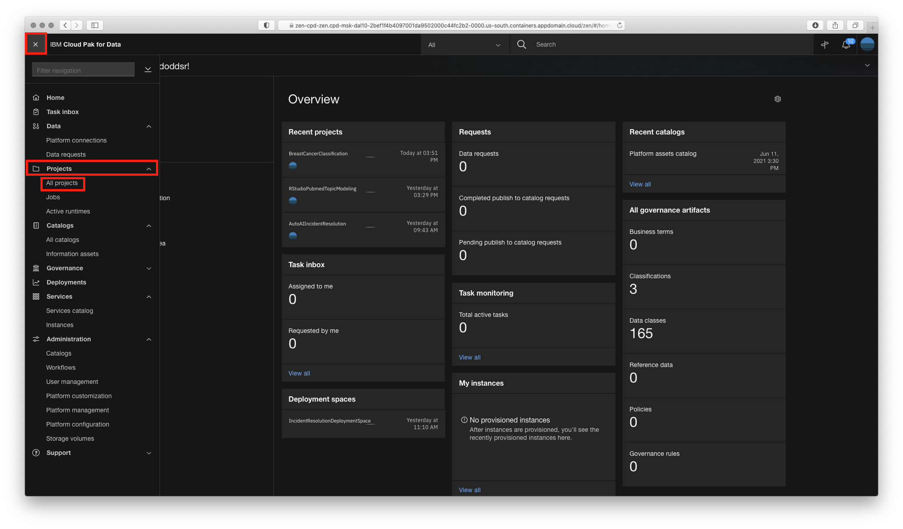

# RStudio for unstructured data and Introductory NLP with Cloud Pak for Data

Working with R in RStudio within CPD and using examples from Pubmed, an analysis of text with the LDA (Local Dirichlet Allocation) topic modeling algorithm will be presented by John Cadley and Luke Czapla.  This session is accessible to both beginners and experts with the R programming language, through providing code and modifying key terms for the search queries.  The visualization of resulting clusters, their importance, and intersection of cluster words within other clusters will then be done in RStudio as well, with a browseable visualization tool.

## Subtopics and Agenda:

- Initialization of an RStudio environment with small resource allocation.
- Syntax for Pubmed queries
- Processes for returning results using Entrez Direct
- Running demonstration LDA topic modeling over Pubmed abstracts
- Additional topics

## Additional Topics (as time allows)

- Document-level clustering with Carrot2, a web interface for clustering any set of documents with cluster topics titles based on any desired key fields.
- Discussion of STC, Lingo, and Bisecting K-means algorithms.


## Installing global dependencies

For this module, additional had to be pre-installed. To [install global packages](https://www.ibm.com/support/producthub/icpdata/docs/content/SSQNUZ_latest/wsj/analyze-data/rstudio-packages.html) we used the following command:

```
install.packages("<package-name>", lib="/cc-home/_global_/R")
```

List of packages to be installed:

* topicmodels
* textmineR
* LDAvis
* servr
* tidytext

* Go the (☰) navigation menu, expand `Projects` and click on the `RStudioPubmedTopicModeling` project pre-created for this section.

    [](../images/navigation/menu-projects.png)
